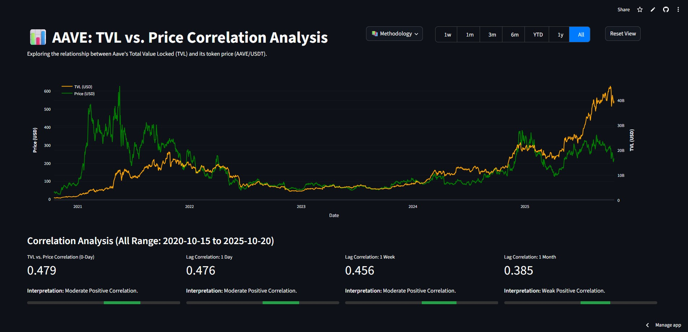

# 🚀 AAVE TVL vs. Price Correlation Dashboard (Quant Research)

[](https://aave-tvl-price.streamlit.app/#aave-tvl-vs-price-correlation-analysis)

An interactive Streamlit application testing the daily correlation between Aave protocol's Total Value Locked (TVL) and the AAVE token price. This project utilizes web scraping, API data, and quantitative analysis techniques to uncover potential Alpha signals in the DeFi space.

 

---

## 💡 The Core Thesis (Why This Project Matters)

* **Problem:** DeFi fundamental data (like TVL) often acts as a leading indicator for token price, but accessing and correlating this data consistently is challenging due to dynamic websites and anti-scraping measures.
* **Hypothesis:** An increase in Aave's TVL historically precedes an increase in the AAVE token price, particularly with a lag of 1 day, 1 week, or 1 month.
* **Solution:** Built an automated data pipeline that overcomes Cloudflare protection to scrape DefiLlama, merges it with CCXT market data, and presents the analysis in a live dashboard.

---

## 📊 Key Findings (Initial Insights)

*(Note: The correlation values presented here are examples from a specific point in time. Since the data updates daily, please refer to the live Streamlit application linked above for the most current findings.)*

* **Long-Term Correlation (0-Day Lag):** A **Moderate Positive Correlation (approx. +0.479)** exists between Aave's TVL and Price over the full historical range, suggesting they generally move together.
* **Potential Alpha Signal (Lagged):**
    * **1-Day Lag:** Shows a **Moderate Positive Correlation (approx. +0.476)**.
    * **1-Week Lag:** Shows a **Moderate Positive Correlation (approx. +0.456)**.
    * **1-Month Lag:** Shows a **Weak Positive Correlation (approx. +0.385)**.
    * *Interpretation:* The correlation remains relatively strong even with a 1-day or 1-week lag, supporting the hypothesis that TVL changes might precede price movements within these shorter timeframes. The signal weakens over a 1-month lag.
* **Visual Insights:** The dual-axis chart clearly visualizes periods where TVL growth leads price rallies and vice-versa.

---

## 🔧 Data Pipeline & Technical Stack

### Data Pipeline Architecture:

1.  **TVL Acquisition:** Historical TVL data for Aave is extracted from the `__NEXT_DATA__` JSON embedded within DefiLlama's HTML. The process uses the **`cloudscraper`** library to bypass **Cloudflare's** JS challenges and bot detection.
2.  **Price Acquisition:** Daily OHLCV price data for the `AAVE/USDT` pair is fetched reliably from the **Gate.io** API using the **`ccxt`** library, implementing looping to retrieve the full history since the earliest TVL date.
3.  **Data Engineering:** The two datasets are cleaned, standardized (timestamps converted to dates), and merged into a single daily time series using **Pandas** (`pd.merge(how='inner')`).
4.  **Automation:** The entire pipeline is scheduled to run daily at **03:00 UTC** via **GitHub Actions**. The updated `aave_tvl_vs_price_merged.csv` is automatically committed back to this repository.
5.  **Visualization:** The Streamlit app (`app.py`) reads the latest committed CSV, calculates correlations dynamically based on user-selected timeframes, and displays the interactive Plotly chart and metrics.

### ⚙️ Technologies Used:

* **Python 3.11+**
* **Scraping/API:** `cloudscraper`, `beautifulsoup4`, `ccxt`, `httpx`
* **Data Analysis:** `pandas`
* **Visualization/Deployment:** `streamlit`, `plotly`
* **Automation:** `GitHub Actions`

---

## 🚀 Getting Started (Run Locally)

### Prerequisites:

* Git
* Python 3.11+
* Create and activate a Virtual Environment (e.g., `python -m venv venv` and `.\venv\Scripts\activate`)

### Installation:

1.  Clone this repository:
   
    ```bash
    git clone [https://github.com/wendytj/aave-tvl-price.git](https://github.com/wendytj/aave-tvl-price.git)
    cd aave-tvl-price
    ```
    
2.  Install dependencies:
   
    ```bash
    pip install -r requirements.txt
    ```

### Usage:

1.  *(Optional)* Run the scraper manually to generate/update the initial CSV:

    ```bash
    python scraper.py 
    ```
    
2.  Run the Streamlit dashboard:
   
    ```bash
    streamlit run app.py
    ```
    
    (The app will open in your browser).

---

## 🤝 Connect & Explore Further

* **View Live Dashboard:** **[https://aave-tvl-price.streamlit.app/](https://aave-tvl-price.streamlit.app/#aave-tvl-vs-price-correlation-analysis)**
* **Author LinkedIn:** **[https://www.linkedin.com/in/wendy-tjung/](https://www.linkedin.com/in/wendy-tjung/)**
* **Methodology Deep Dive,  Read a detailed breakdown on Medium:** [Coming Soon]()

---
